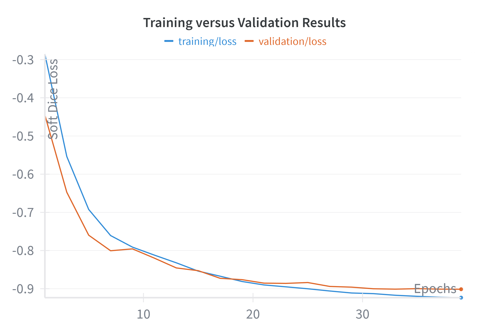
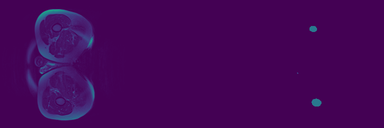

# 3D Improved UNet Image Segmentation - Prostate Case Study
This project is the final report assessment task for the University of 
Queensland's COMP3710 - Pattern Recognition and Analysis course. Specifically,
this project implements the [3D Improved UNet](https://arxiv.org/pdf/1802.10508) 
developed by Isensee et al. for the task of segmenting a downsampled version of
the [Prostate 3D MRI data](https://data.csiro.au/collection/csiro:51392v2?redirected=true).
The prohects aims to automatatically segmente the body outline, bone,
bladder, rectum, and prostate with a Dice similarity score of 0.7 on each label
in the test set. 

The implementation was a success, being able to achieve a Dice similarity score
of 0.839 in the worst case and 0.997 in the best case. A sample visualisation
on the test set of the segmented image of this model can be seen below. The 
input can be seen on the left, the true segmented imagine in the middle, and 
the prediction on the right.

  

## Dataset
The [Prostate 3D MRI dataset](https://data.csiro.au/collection/csiro:51392v2?redirected=true) 
is a 3D dataset comprised of 211 Nifti scans from the MRI scan of 38 patients. 
Each scan has also been segmented manually by a MR physicist with more than 
10 years of experience into 6 key categories: background, body outline, bone, 
bladder, rectum, and prostate. 

This project uses these segmented images as the ground truth for the automated 
segmentation task aimed to be achieved through the use of a 3D Improved UNet. 


## 3D Improved UNet
The 3D Improved UNet was proposed by [Isensee et al.](https://arxiv.org/pdf/1802.10508) 
in the BRATS 2017 Challenge for identifying different parts of brain tumors. 
The architecture was inspired by the original 3D UNet developed by 
[Cicek et al.](https://arxiv.org/abs/1606.06650), which itself was a derivative
of the orginal [2D UNet](https://arxiv.org/abs/1505.04597) proposed for medical 
imaging. 


*Reference: [Isensee et al.](https://arxiv.org/pdf/1802.10508)*

### UNet Comparison
The 3D Improved UNet improves upon the original 2D UNet in a range of ways. 

1. Deeper than the original 3D Unet (5 layers instead of the 4 layers) .
2. Utilises Leaky ReLU over the traditional ReLU with a negative slope of 0.01.
3. Uses instance normalisation over batch normalisation as the stochasticity induced by the small batch size may destabilise batch normalisation.
4. Introduces residul connections within the aggergation and context pathway.
5. Loss function uses soft dice loss only instead of the original weighted cross-entropy loss.
6. Uses upsampling modules instead of transposed up-convolution to avoid checker-board artifications.
7. Segmentation modules at used in layers 3, 2, and 1 and later combined to achieve a higher accuracy.

### Modules
- **Context Module** - A context module aims to achieve information from the broader context, and is simply a pre-activation residual block. There are two 3x3x3 convolutions layers seperated by a dropout layer of 0.3.
- **Upsampling Module** - An upsampling module takes in low-resolution feature maps and upscales the compressed information. It is comprised of a simple upsample that doubles the features in each of the three spatial dimensions, bnefore apply a 3x3x3 convlution to halve the number of features.
- **Localisation Module** - A localisation module recombines the higher dimensionality feature map with the context modules after they have been convolved together, reducing the number of feature maps for better memory consumption. It is comprsied of a 3x3x3 convolutions followed by a 1x1x1 convolution to halve the number of feature maps.
- **Segmentation Layer** - A segmentation layer is used to get segmentation information at different levels in the UNet architecture for better performance. It uses a 1x1x1 convolution with the number of output channels being the number of labels in the model to be segmented.

### Aggregation and Context Pathway
The aggregation pathway aims to gain broader contextual information from the 
entire image. It begins with a 3x3x3 convolution followed by
a context module. The output of the context module and the convolution are then
summed together. Following the initial layer, the same process is repeated four
more times. However, instead of using a stide of 2 is used instead of 1.

### Localisation Pathway
The localisation pathway utilises the developed upsampling, localisation, and segmentation modules developed to localise the information gained and segment the image. On layer 5, the beginning of the localisation pathway, a single upsampling module is used. The output of this upsampling module is then concatenated with the output of the context module of the layer above. The output of this concatenation is then fed into a localisation module, and the process repeats for layers 4, 3, and 2. On layers 3 and 2 a segmenation layer is added, taking in the output of the localisation module and segmenting the image. The segmentation from layer 3 is simply 2x upscaled in each of the spatial direction before being added to the segmentation from layer 2. Layer 1 is unique in which it contains only a simple 3x3x3 convolution with a stride of one after the concatenation of the context module with the localised information from the layer below. The output of this convolution is then segmented in a segmentation layer, and summed to the combined output of Layer 3 and 2 which has again been upsample to reach the correct dimenion. Finally, a softmax activation function is implemented to give class probabilities.

## Usage
To reproduce the predictive model ensure the following:
1. Clone this repository into the working directory
2. Install the necessary dependencies 
3. [Download the data](https://data.csiro.au/collection/csiro:51392v2?redirected=true) and create a new folder called 'data' in the same folder as train.py. Copy the downloaded data into this data folder. The structure should appear as follows:

<pre>
> PatternAnalysis-2025
__> recognition
____> s4699027_task_3D_uNet
______> assets
______> data                                  <-- Copy data into data folder
________> HipMRI_study_complete_release_v1    <-- Downloaded data
______> .gitignore
______> dataset.py
______> modules.py
______> predict.py
______> README.MD
______> train.py
______> utils.py
</pre>

To train, validate, and test the 3D Improved UNet model on the dataset, with visualisations at each epoch, run the following command:
<pre>
python train.py
</pre>

To use the saved model, if it exists, to predict on the test set, evaluate the model, and visualise the outputs, run the following command:
<pre>
python predict.py
</pre>

Both train.py and predict.py will automatically generate a model folder, a visualisation folder, and a wandb folder in the same folder where train.py is present. If the desired locations for these outputs is not in the same folder, they can be changed by changing the ```MODEL_PATH```, ```VISUAL_PATH_INPUTS```, ```VISUAL_PATH_VALIDATION```, and ```VISUAL_PATH_OUTPUTS``` global parameters under train.py.

### Dependices
The following dependencies are necessary:
<pre>imageio 2.37.0
matplotlib 3.10.7
nibabel 5.3.2
numpy 2.2.6
torch 2.9.0
torchio 0.21.0
torchvision 0.24.0
tqdm 4.67.1
wandb 0.22.3
</pre>

The [wandb library](https://wandb.ai/site/) allows users to keep track of the accuracy and loss of the model during and after training. An account is required to use this library, and at the start of each session an API key from the account is required. Refer to the Weights & Biases website for further details.

## Results
### Training
The training process requires the use of an a100 GPU due to the high VRAM requirements of the large convolution processes. The model was train with the following hyperparameters:
- **Batch Size**: 2
- **Learning Rate**: 4e-4
- **Epochs**: 20
- **Scheduler**: Cosine Annealing Learning Rate Scheduler
- **Optimiser**: adam

NOTE: COME BACK TO THIS LATER!!

A common issue with training for medical imaging is overfitting to a certain style of data. For example, the segmentation may only work in a particular orientation. One way to overcome this is with data pre-processing and augmentation. The following transforms were applied:
- **Horizontal Flipping**: Used to ensure orientation does not matter, 50% chance.
- **Vertical Flipping**: Used to ensure orientation does not matter, 50% chance.

NOTE: COME BACK TO THIS LATER!!

Finally, as per the model architecture a multiclass soft dice loss was used as the criterion of evaluation. Soft dice loss measures the overlap between two sets, which is better for evaluating segmentation performance and much better for class imbalances commonly found in medical imaging. As it is a loss function, the more negative the higher accuracy the result.

During the training, the following training/validation curve for the soft dice loss was produced. The closeness in both trianing and validation losses indicate that no overfitting to the training data was present. 



The average multiclass dice coefficient and the training and validation dice similarrity coefficients for each indiivdual class were also plotted. The results show clearly the minimum accuracy can be achieved in all three sets of data.


### Visualisation over Epochs
A set of visualisations over each epoch was also generated to sese how improvements over time occur.
| Epoch | Visualisation                                | Validation Loss  | Training Loss  |
|-------|----------------------------------------------|------------------|----------------|
| 1     |      | -0.4453          | -0.2856        |
| 3     |      | -0.7598          | -0.6924        |
| 5     |      | -0.7957          | -0.7911        |
| 10    |    | -0.8763          | -0.8811        |
| 15    |    | -0.8959          | -0.9112        |
| 20    |    | -0.9013          | -0.9234        |


### Testing
Having successfully trained the model, key evaluations were made against the test set. The minimum Dice Similiraty Score for each class independently was required to be above 0.7, which was easily passable by the developed model. 

The Dice Similarity Score for each class was evaluated as follows:
| Class | Structure      | Score   |
|-------|----------------|---------|
| 0     | Background     | 0.9968  |
| 1     | Body Outline   | 0.9795  |
| 2     | Bone           | 0.8630  |
| 3     | Bladder        | 0.9134  |
| 4     | Rectum         | 0.8394  |
| 5     | Prostate       | 0.8434  |

An example visualistation of the output shows the effectiveness of the model. Note that the classes are in order of darkest to lightest when visualised.

  


## References
Isensee, P. Kickingereder, W. Wick, M. Bendszus, and K. H. Maier-Hein, “Brain Tumor Segmentation
and Radiomics Survival Prediction: Contribution to the BRATS 2017 Challenge,” Feb. 2018. [Online] 
Available: https://arxiv.org/pdf/1802.10508

O. Cicek, A. Abdulkadir, S. S. Lienkamp, T. Brox, and O. Ronneberger, “3D U-Net: Learning Dense Vol-
umetric Segmentation from Sparse Annotation,” in Medical Image Computing and Computer-Assisted Inter-
vention – MICCAI 2016, ser. Lecture Notes in Computer Science, S. Ourselin, L. Joskowicz, M. R. Sabuncu,
G. Unal, and W. Wells, Eds. Cham: Springer International Publishing, 2016, pp. 424–432. 
Available: https://arxiv.org/abs/1606.06650 

W. Dai, B. Woo, S. Liu, M. Marques, C. B. Engstrom, P. B. Greer, S. Crozier, J. A. Dowling, and S. S. Chandras,
“CAN3D: Fast 3D Medical Image Segmentation via Compact Context Aggregation,” arXiv:2109.05443 [cs,
eess], Sep. 2021, arXiv: 2109.05443. [Online]. Availabe https://arxiv.org/abs/2109.05443 

O. Ronneberger, P. Fischer, and T. Brox, “U-Net: Convolutional Networks for Biomedical Image Segmentation,” in Medical Image Computing and Computer-Assisted Intervention – MICCAI 2015, ser. Lecture Notes in Computer Science, N. Navab, J. Hornegger, W. M. Wells, and A. F. Frangi, Eds. Cham: Springer International Publishing, 2015, pp. 234–241. 